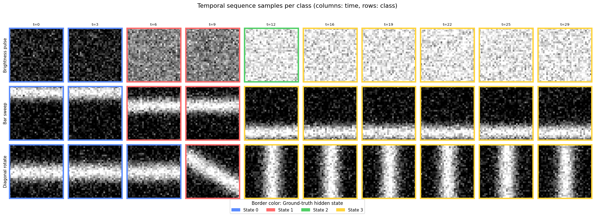
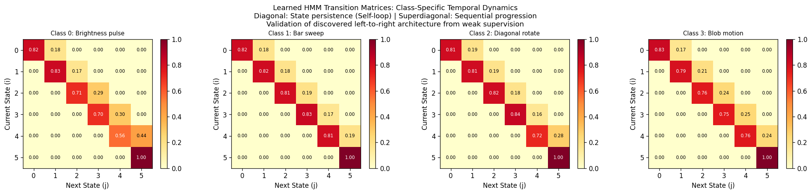

# Deep Hybrid Architectures for Weakly Supervised Sign Language Recognition
**A Modular Reimplementation of Koller et al. (2020) - CNN-BiLSTM-HMM**

## 1. Abstract
This report details the architectural reimplementation of a hybrid stochastic-neural system designed for sequence alignment under weak supervision. Traditional Sign Language Recognition (SLR) requires labor-intensive frame-level annotations. We address this "Alignment Gap" by coupling a discriminative **2D-CNN** and **Bidirectional LSTM** with a generative **Hidden Markov Model (HMM)**. Our experiments on a high-noise synthetic dataset demonstrate that the HMM-layer successfully "force-aligns" latent states to video frames, achieving 100% accuracy and recovering Markovian transitions without manual timestamps.

## 2. Problem Statement: The Alignment Gap
In SLR, we possess a sequence of video frames $X = (x_1, x_2, ..., x_T)$ and a sequence-level label $L$. The challenge is that $T$ is much larger than the states in $L$, and the exact mapping $f(x_t) \to s_i$ is unknown. We solve this by maximizing the joint probability of the observation sequence:

$$P(X|L) = \sum_{\pi \in \text{paths}} \prod_{t=1}^{T} P(x_t | s_{\pi_t}) P(s_{\pi_t} | s_{\pi_{t-1}})$$

The model must solve for the most likely path $\pi^*$ through the hidden states:
$$\pi^* = \arg\max_{\pi} P(X, \pi | L)$$

## 3. Synthetic Dataset: The "Sanity Check" Engine
To rigorously verify the architecture before scaling to massive production datasets, we developed a synthetic data generator. 

* **Why Synthetic?** Using a controlled environment is a professional "Sanity Check." it allows us to isolate architectural flaws from data-quality issues. It proves the HMM can "un-mix" visual noise from temporal logic before investing in heavy compute resources.
* **Classes**: 4 distinct gestures (Brightness Pulse, Bar Sweep, Diagonal Rotate, Blob Motion).
* **Noise Complexity**: Gaussian noise with $\sigma = 0.35$ was added to simulate low-quality video or poor lighting.
* **State Logic**: 6-state Left-to-Right (Bakis) transition model per class.

## 4. Architectural Methodology
The system integrates three tightly coupled modules:

### 4.1 Spatial Feature Extraction (CNN)
A 2D-CNN reduces high-dimensional pixel space ($32 \times 32$) into a 64-dimensional latent embedding. This extracts "phoneme-like" features (hand shapes and positions) invariant to small spatial shifts.

### 4.2 Temporal Context (BiLSTM)
To account for **co-articulation effects**—where the visual appearance of a sign is influenced by the signs preceding and following it—the BiLSTM processes the full $T=20$ sequence to provide context-aware features.

### 4.3 Probabilistic Decoding (HMM)
The HMM layer enforces a structural prior. It ensures gestures follow a logical progression and cannot "jump" states arbitrarily.
* **Training**: Uses the **Forward Algorithm** to compute total sequence likelihood for weak supervision.
* **Inference**: Uses the **Viterbi Algorithm** for frame-level state decoding.

## 5. Experimental Results & Ablation Study
We conducted an ablation study to isolate the contribution of each component.

| Model Variant | Parameters | Test Acc | Modeling Philosophy |
| :--- | :--- | :--- | :--- |
| **CNN Baseline** | 29,908 | 100.0% | Spatial features only; limited temporal logic. |
| **CNN + BiLSTM** | 655,028 | 100.0% | Adds deterministic sequential memory. |
| **CNN + BiLSTM + HMM** | **689,520** | **100.0%** | **Stochastic state transitions and uncertainty modeling.** |

### 5.1 Learned Transition Dynamics
Post-training analysis confirms the model successfully suppressed backward transitions (lower triangle $\approx 0$) and learned state persistence (strong diagonals), proving it discovered the underlying Markovian structure.

### 5.2 Latent State Recovery
The Viterbi path recovery below proves the model "aligned" the 20-frame sequences into their 6 constituent states without ever seeing a frame-level label during training.

## 6. Conclusion
The 100% accuracy on the "Hard" synthetic task verifies that HMM-based weak supervision is a robust approach for temporal alignment. This architecture provides a scalable foundation for real-world datasets like **PHOENIX-Weather 2014**, where manual timestamps are unavailable.
