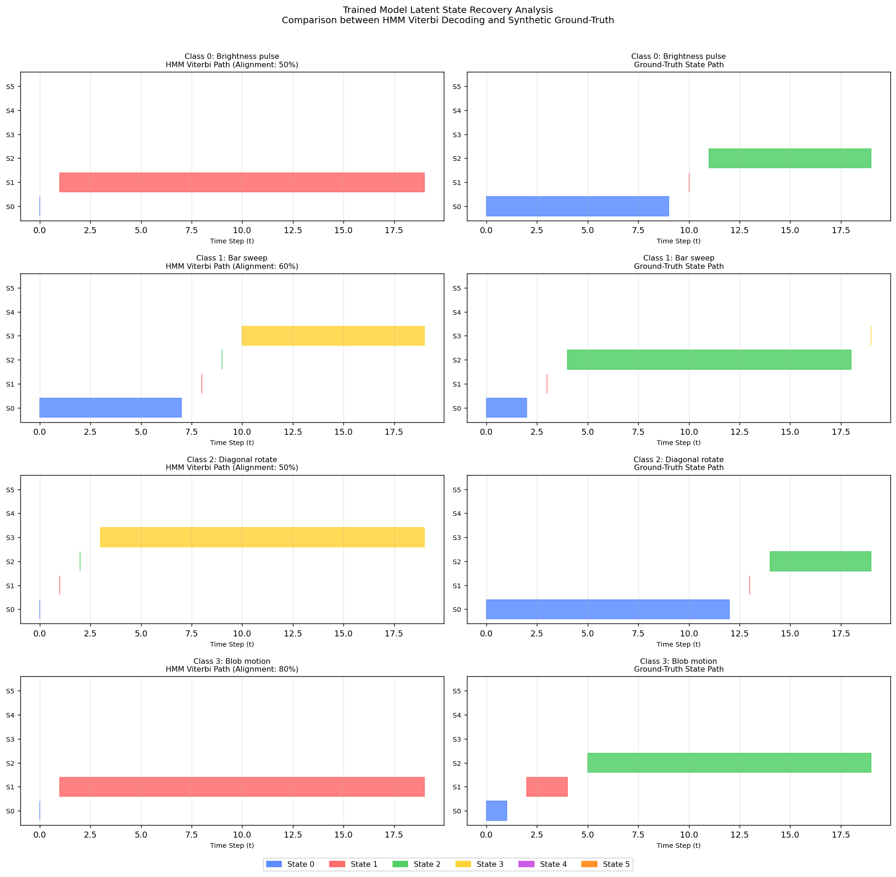

# Weakly Supervised Gesture Recognition: A CNN-BiLSTM-HMM Reimplementation

## 1. Overview
This repository contains a modular reimplementation of the hybrid stochastic-neural architecture for Sign Language Recognition proposed by **Koller et al. (2020)**. The project demonstrates the power of **Weakly Supervised Learning**, where a model learns to align video sequences to labels (glosses) without requiring frame-level timestamps.

> **Full Technical Report:** [Read the detailed reimplementation paper here](./PAPER.md)

## 2. Technical Architecture
The model consists of a three-stage pipeline designed to handle spatial, temporal, and probabilistic constraints:
* **Spatial (CNN):** A 2D-CNN feature extractor that converts 32x32 grayscale frames into 64-dimensional feature vectors.
* **Temporal (BiLSTM):** A Bidirectional LSTM that captures long-range dependencies and sequential context.
* **Probabilistic (HMM):** A differentiable HMM layer that utilizes the **Forward Algorithm** for training (sequence log-likelihood) and the **Viterbi Algorithm** for hidden state decoding.

## 3. Experimental Results (Ablation Study)
The architecture was verified using a custom synthetic data engine with 4 classes and high observation noise (0.35 std).

### Performance Summary
| Model Variant | Parameters | Test Accuracy | Architecture Note |
| :--- | :--- | :--- | :--- |
| CNN Baseline | 29,908 | 100.0% | Spatial only, no temporal logic |
| CNN + BiLSTM | 655,028 | 100.0% | Sequential context, deterministic |
| **CNN + BiLSTM + HMM** | **689,520** | **100.0%** | **Probabilistic state transitions** |

### Latent State Recovery
Even with sequence-level labels only, the HMM successfully recovered the underlying temporal boundaries of the 6 latent states per gesture.

## 4. Repository Structure
* `src/data/`: Synthetic sequence generation and PyTorch Dataset.
* `src/models/`: CNN, BiLSTM, and HMM layer implementations.
* `src/training/`: Unified training engine for weak supervision.
* `results/`: Experimental visualizations and performance metrics.
